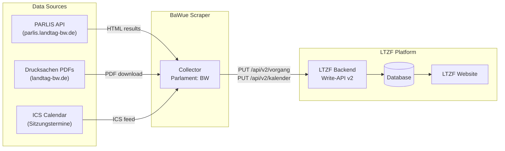
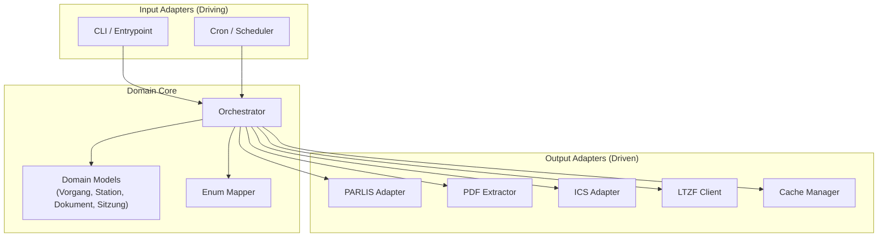
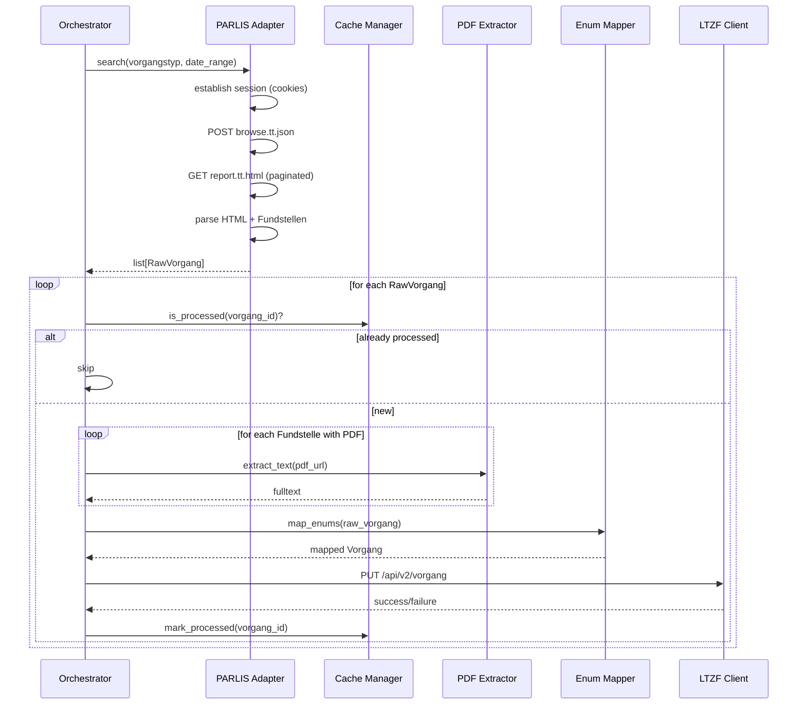
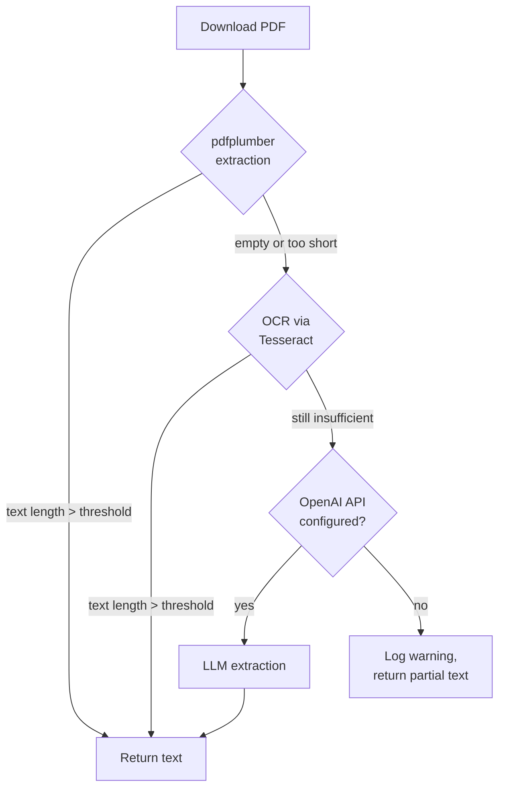

# Architecture: BaWue Scraper

## 1. System Overview

The BaWue Scraper is a **Collector** component within the Landtagszusammenfasser (LTZF) ecosystem. It gathers legislative data from the Baden-Württemberg state parliament and delivers it to the LTZF backend via a REST API.



**Key characteristics:**
- Parliament code: `BW`
- Current Wahlperiode: 17
- Authentication: `X-API-Key` header with `collector` scope
- The LTZF backend handles deduplication — the scraper does not need to

## 2. Technology Choice

**Language: Python** — matches the reference collector implementation and the existing `parlis_test.py` research script.

| Dependency | Purpose |
|------------|---------|
| `requests` | HTTP sessions, PARLIS API interaction |
| `lxml` | HTML parsing of PARLIS results |
| `pdfplumber` | PDF text extraction (primary) |
| `pytesseract` / `Pillow` | OCR fallback for scanned PDFs |
| `icalendar` | ICS calendar parsing |
| `openai` | Optional: LLM-based text extraction for difficult PDFs |
| `pydantic` | Domain model validation |

**Build & packaging:** Poetry or pip with `pyproject.toml`.

## 3. Hexagonal Architecture

The scraper follows a **ports & adapters** (hexagonal) architecture to isolate the domain logic from external systems.



**Ports** (interfaces defined in the domain):
- `VorgangSource` — fetches raw Vorgang data from a parliament
- `DocumentExtractor` — extracts text from a document binary
- `CalendarSource` — provides session/calendar data
- `LtzfApi` — submits data to the LTZF backend
- `Cache` — tracks already-processed items

**Adapters** (implementations):
- `ParlisAdapter` implements `VorgangSource`
- `PdfExtractor` implements `DocumentExtractor`
- `IcsAdapter` implements `CalendarSource`
- `LtzfClient` implements `LtzfApi`
- `CacheManager` implements `Cache`

## 4. Data Flow



## 5. Component Breakdown

### 5.1 Orchestrator

Coordinates the entire scraping pipeline.

**Responsibilities:**
- Run scraping cycles (per Vorgangstyp, per date range)
- Delegate to adapters for data retrieval and submission
- Handle errors per-Vorgang without stopping the full run
- Log progress and statistics

### 5.2 PARLIS Adapter

Implements the `VorgangSource` port. Encapsulates all PARLIS-specific logic.

**Responsibilities:**
- Session management (load start page, extract cookies)
- Construct search queries (Vorgangstyp, Wahlperiode, date range)
- Execute search via `POST browse.tt.json`
- Fetch paginated results via `GET report.tt.html`
- Parse HTML records (XPath: `.//div[contains(@class, "efxRecordRepeater")]`)
- Parse Fundstellen text into structured station data (type, date, Drucksache, committee, PDF URL)
- Parse HTML comment blocks for additional raw field data (JSON with field codes like WMV35)

### 5.3 PDF Extractor

Implements the `DocumentExtractor` port. Extracts fulltext from parliamentary documents.

**Responsibilities:**
- Download PDF from `landtag-bw.de/resource/blob/{id}/...`
- Extract text using a waterfall strategy (see section 7)
- Compute document hash for the `Dokument.hash` field
- Return extracted text and metadata (page count)

### 5.4 ICS Adapter

Implements the `CalendarSource` port.

**Responsibilities:**
- Fetch the ICS calendar from `landtag-bw.de`
- Parse VEVENT entries into Sitzung structures
- Extract date, gremium category, and available metadata

### 5.5 Enum Mapper

Maps PARLIS terminology to LTZF enum values.

**Responsibilities:**
- Map Vorgangstyp strings to LTZF `typ` enum (see section 8)
- Map Fundstelle station types to LTZF `Stationstyp` enum
- Map document references to LTZF `Dokumententyp` enum
- Flag unmappable values for manual review

### 5.6 LTZF Client

Implements the `LtzfApi` port.

**Responsibilities:**
- Authenticate via `X-API-Key` header
- Submit Vorgänge via `PUT /api/v2/vorgang`
- Submit Sitzungen via `PUT /api/v2/kalender/{parlament}/{datum}`
- Handle HTTP errors and rate limiting

### 5.7 Cache Manager

Implements the `Cache` port. Prevents redundant processing.

**Responsibilities:**
- Track processed Vorgang IDs (e.g. `V-12345`)
- Persist across runs (file-based or SQLite)
- Support cache invalidation for re-processing

### 5.8 Domain Models

Pydantic models that mirror the LTZF API data structures.

**Models:** `Vorgang`, `Station`, `Dokument`, `Sitzung`, `Gremium`, `Autor`, `Top`

All models enforce required fields from the LTZF API specification and serialize to the expected JSON format.

## 6. PARLIS Scraping Strategy

### 6.1 Session Management

PARLIS requires an active session (cookies) before API calls succeed.

1. `GET https://parlis.landtag-bw.de/parlis/` — obtain session cookies
2. Store cookies in `requests.Session` for subsequent calls
3. Set `Referer: https://parlis.landtag-bw.de/parlis/` on all requests
4. Sessions expire — re-establish on `401` or connection errors

### 6.2 Search Query Construction

```json
{
    "action": "SearchAndDisplay",
    "report": {
        "rhl": "main",
        "rhlmode": "add",
        "format": "suchergebnis-vorgang-full",
        "mime": "html",
        "sort": "SORT01/D SORT02/D SORT03"
    },
    "search": {
        "lines": {
            "l1": "<wahlperiode>",
            "l2": "<start_date DD.MM.YYYY>",
            "l3": "<end_date DD.MM.YYYY>",
            "l4": "<vorgangstyp>"
        },
        "serverrecordname": "vorgang"
    },
    "sources": ["Star"]
}
```

**Constraints discovered during testing:**
- Only `serverrecordname: "vorgang"` works — other values hang indefinitely
- Only `format: "suchergebnis-vorgang-full"` returns usable results
- Unfiltered searches (no Vorgangstyp) also hang — always filter by type

### 6.3 Pagination

1. `POST browse.tt.json` returns `{ report_id, item_count }`
2. Fetch pages: `GET report.tt.html?report_id=X&start=N&chunksize=50`
3. Increment `start` by `chunksize` until `start >= item_count`

### 6.4 Fundstellen Parsing

Each Vorgang record contains Fundstellen (references) that encode station data as semi-structured text:

```
"Gesetzentwurf    Fraktion GRÜNE, Fraktion der CDU  04.02.2026 Drucksache 17/10266   (13 S.)"
"Erste Beratung   Plenarprotokoll 17/141 05.02.2026"
"Beschlussempfehlung und Bericht    Ausschuss für Wirtschaft  02.02.2026 Drucksache 17/10210"
```

Extractable fields via regex: station type, date, Drucksache number, Plenarprotokoll reference, committee name, page count, PDF URL.

### 6.5 Incremental Date Filtering

Large Vorgangstypen (e.g. "Kleine Anfrage" with 4000+ hits) cause the API to return `status: "running"` without a `report_id`. Strategy:

1. Try full search for a Vorgangstyp
2. If no `report_id` returned but `hits > 0` — the result set is too large
3. Subdivide into smaller date ranges (e.g. monthly windows)
4. Repeat until each window returns a usable `report_id`

## 7. PDF Extraction Pipeline



| Stage | Tool | When |
|-------|------|------|
| 1. Direct extraction | `pdfplumber` | Always tried first — fast, no external dependencies |
| 2. OCR fallback | `pytesseract` + `Pillow` | When pdfplumber returns empty/minimal text (scanned docs) |
| 3. LLM extraction | OpenAI API | Optional, when OCR also fails (handwritten, poor quality) |

Each extracted document gets a SHA-256 hash computed from the PDF binary for the `Dokument.hash` field.

## 8. Enum Mapping

### Vorgangstyp → LTZF `typ`

| PARLIS Vorgangstyp | LTZF `typ` |
|--------------------|------------|
| Gesetzgebung | `gg-land-parl` |
| Haushaltsgesetzgebung | `gg-land-parl` |
| Volksantrag | `gg-land-parl` |
| Antrag | `sonstig` |
| Kleine Anfrage | `sonstig` |
| Große Anfrage | `sonstig` |
| Mündliche Anfrage | `sonstig` |
| Aktuelle Debatte | `sonstig` |
| Regierungserklärung/Regierungsinformation | `sonstig` |
| Untersuchungsausschuss | `sonstig` |
| *(all others)* | `sonstig` |

### Fundstelle station type → LTZF `Stationstyp`

| Fundstelle text pattern | LTZF `Stationstyp` |
|------------------------|---------------------|
| Gesetzentwurf (from Landesregierung) | `preparl-regent` |
| Gesetzentwurf (from Fraktion/Abgeordnete) | `parl-initiativ` |
| Antrag | `parl-initiativ` |
| Erste Beratung, Zweite Beratung, Dritte Beratung | `parl-vollvlsgn` |
| Beschlussempfehlung und Bericht | `parl-ausschber` |
| Ausschussberatung | `parl-ausschber` |
| Zustimmung, Annahme | `parl-akzeptanz` |
| Ablehnung | `parl-ablehnung` |
| Ausfertigung | `postparl-vesja` |
| Gesetzblatt | `postparl-gsblt` |
| Inkrafttreten | `postparl-kraft` |
| *(unrecognized)* | `sonstig` |

### Dokumententyp mapping

| Document context | LTZF `Dokumententyp` |
|-----------------|----------------------|
| Gesetzentwurf (vorparlamentarisch) | `preparl-entwurf` |
| Gesetzentwurf (parlamentarisch) | `entwurf` |
| Antrag | `antrag` |
| Kleine/Große/Mündliche Anfrage | `anfrage` |
| Antwort (Stellungnahme der Regierung) | `antwort` |
| Beschlussempfehlung | `beschlussempf` |
| Stellungnahme | `stellungnahme` |
| Plenarprotokoll | `redeprotokoll` |
| Mitteilung | `mitteilung` |
| *(unrecognized)* | `sonstig` |

## 9. Error Handling

### Retry Strategy

| Error type | Strategy | Max retries | Backoff |
|-----------|----------|-------------|---------|
| Connection timeout | Retry with exponential backoff | 3 | 2s, 4s, 8s |
| HTTP 429 (rate limit) | Retry after `Retry-After` header | 5 | As specified |
| HTTP 5xx (server error) | Retry with backoff | 3 | 5s, 10s, 20s |
| HTTP 4xx (client error) | Do not retry, log and skip | 0 | — |
| PDF download failure | Retry, then skip document | 2 | 3s, 6s |
| Session expired (401/cookie issues) | Re-establish session, retry | 1 | — |

### Circuit Breaker

If more than **5 consecutive requests** to the same host fail, pause scraping for that source for **5 minutes** before retrying. This prevents hammering a down service and respects the data source.

### Graceful Degradation

- If PDF extraction fails → submit Vorgang without `volltext`, log warning
- If ICS calendar is unavailable → skip Sitzung data, continue with Vorgänge
- If a single Vorgang fails → log error, continue with next Vorgang
- If LTZF API is unreachable → queue submissions for later retry (or abort run with clear error)

## 10. Deployment

### Docker Container

```
Dockerfile
├── Base: python:3.13-slim
├── System deps: tesseract-ocr, tesseract-ocr-deu
├── Python deps: via poetry install / pip install
└── Entrypoint: python -m bawue_scraper
```

### Scheduling Modes

| Mode | Use case | Mechanism |
|------|----------|-----------|
| **Daemon** | Continuous operation | Internal scheduler (e.g. `schedule` library), runs at configured interval |
| **Cron** | Periodic execution | External cron / Kubernetes CronJob triggers container, exits after run |
| **Manual** | Development / debugging | CLI invocation with optional flags (`--type`, `--date-from`, `--date-to`) |

### Configuration (Environment Variables)

| Variable | Required | Description |
|----------|----------|-------------|
| `LTZF_API_URL` | Yes | LTZF backend base URL |
| `LTZF_API_KEY` | Yes | API key (scope: collector) |
| `COLLECTOR_ID` | Yes | Unique identifier for this collector instance |
| `OPENAI_API_KEY` | No | Enables LLM-based PDF extraction fallback |
| `SCRAPE_INTERVAL_HOURS` | No | Interval between scraping cycles (daemon mode, default: 24) |
| `PARLIS_REQUEST_DELAY_S` | No | Delay between PARLIS requests (default: 1.0) |
| `LOG_LEVEL` | No | Logging level (default: INFO) |
| `CACHE_DIR` | No | Directory for persistent cache (default: `./cache`) |

## 11. Risks & Mitigation

| Risk | Impact | Likelihood | Mitigation |
|------|--------|------------|------------|
| **PARLIS API changes** | Scraper breaks entirely | Medium | The API is undocumented and could change at any time. Mitigation: comprehensive error logging, health-check alerts, quick-fix turnaround. Pin known-working query formats in config. |
| **PARLIS session instability** | Intermittent failures | Medium | Automatic session re-establishment on auth failures. Monitor session lifetime. |
| **Large result sets** | API returns `status: "running"` without data | High (confirmed) | Incremental date filtering to keep result sets within PARLIS limits. |
| **PDF quality** | Missing or garbled fulltext | Medium | Three-stage extraction waterfall (pdfplumber → OCR → LLM). Accept partial text rather than failing. |
| **Enum ambiguity** | Incorrect mapping of PARLIS types to LTZF enums | Medium | Conservative mapping — use `sonstig` as fallback. Log all unmapped values for review. Maintain mapping table in config for easy updates. |
| **Rate limiting by Landtag** | IP blocked, scraper unusable | Low | Respectful delays between requests (configurable). Identify via descriptive `User-Agent`. |
| **Fundstelle text format changes** | Station parsing breaks | Medium | Regex-based parsing with fallback to raw text. Unit tests with known Fundstelle samples. |
| **verfassungsaendernd not available** | Required field cannot be determined | High (confirmed) | PARLIS does not expose this field. Infer from title keywords (e.g. "Verfassungsänderung", "Grundgesetz"). Default to `false` with log note. |

## 12. Future Work

The following data sources are documented in the [requirements](anforderungen.md) but deferred to later phases. The initial implementation focuses on the three primary sources (PARLIS, PDFs, ICS calendar).

| Source | Priority | What it adds | Why deferred |
|--------|----------|-------------|--------------|
| **Beteiligungsportal** | Ergänzend | Vorparlamentarische Entwürfe, Stellungnahmen (`preparl-regent`, `preparl-regbsl` stations) | Requires separate HTML scraper; low overlap with PARLIS data |
| **Kabinettsberichte (STM)** | Optional | Signal source for new Regierungsentwürfe | Unstructured PR text; useful only as trigger, not as data source |
| **Gesetzblatt BaWue** | Ergänzend | Verkündungen (`postparl-gsblt` station) | Web search required; PARLIS may partially cover this via Fundstellen |

The hexagonal architecture supports adding these as new adapters implementing the `VorgangSource` port without changes to the domain core.
